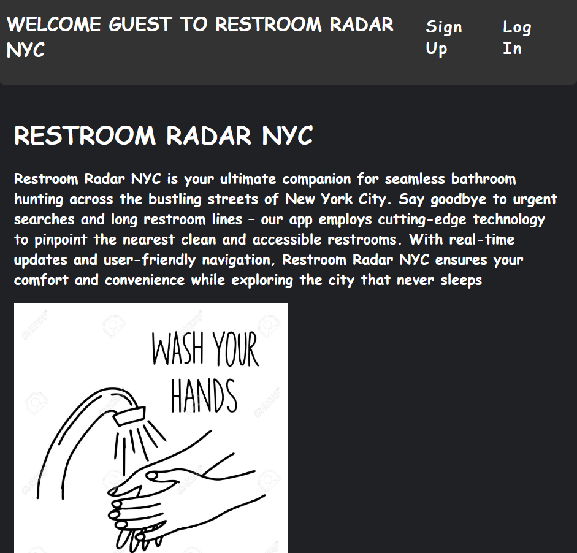

# Restroom Radar NYC
Restroom Radar NYC is your ultimate companion for seamless bathroom hunting across the bustling streets of New York City. Say goodbye to urgent searches and long restroom lines – our app employs cutting-edge technology to pinpoint the nearest accessible restrooms. With real-time updates and user-friendly navigation, Restroom Radar NYC ensures your comfort and convenience while exploring the city that never sleeps.


### Image




## Introduction

- Restroom Radar NYC is a React-Flask fullstack application that allows users to read, create, update, and delete reviews created for bathrooms across NYC.
- You must create a user name and a password in order to log in.
- You can select a bathroom to see the details of the bathroom and the reviews.
- You can add any public restroom in NYC. 

---
## Technologies Used

- Frontend:
  - React
  - Redux
---
- Backend:
  - Python 
  - Flask
  - SQLAlchemy


## Installation

### `server/`

Restroom Radar NYC contains a default `Pipfile` with some basic dependencies. 

To download the dependencies for the backend server, run:

```console
pipenv install
pipenv shell
```

You can run your Flask API on [`localhost:5555`](http://localhost:5555) by
running:

```console
python server/app.py
```

Check that your server serves the default route `http://localhost:5555`.

### `client/`

Restroom Radar NYC also sets the `proxy` field to forward
requests to `"http://localhost:5555"`.

To download the dependencies for the frontend client, run:

```console
npm install --prefix client
```

You can run your React app on [`localhost:3000`](http://localhost:3000) by
running:

```sh
npm start --prefix client
```

Check that your the React client displays a default page
`http://localhost:3000`. 

---

## Resources
No contributing at this time. For questions, please reach out to restroomradar@gmail.com
